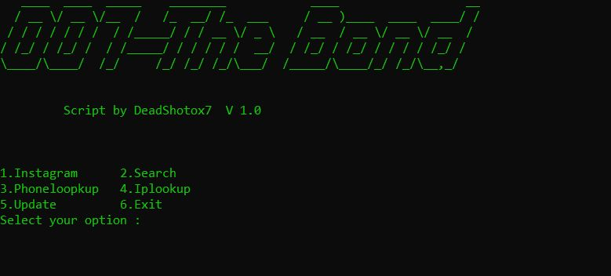

# 007-TheBond

## Description

007-TheBond is a Python OSINT (Open Source Intelligence) script that lets you find the information of your friends, family, crushes that don't talk to you, and your enemies.😎

# Screenshot of the Script



## Features

1. **Instagram OSINT**
   - Obtain information from Instagram profiles.
2. **Phonenumber OSINT**

   - Gather details using a phone number.

3. **Search Username Across Social Media**

   - Explore a username's presence on different social media platforms.

4. **Search the Web**

   - Perform a general web search for information.

5. **IP Lookup**
   - Retrieve details about an IP address.

## Disclaimer

**Disclaimer:** Deadshot0x7 will not be responsible if you misuse the script. By using the script, you acknowledge that you will be responsible for any loss you incur.

## Version

**Version:** 3.0

This is the official release of the Project.

## Usage

1. Clone the repository using git clone:
   ```bash
   git clone https://github.com/Deadshot0x7/007-TheBond.git
   ```
2. Navigate to the directory:
   ```bash
   cd 007-TheBond
   ```
   Simply click `bash run_007-TheBond.bat ` on Windows or `bash run_007-TheBond.sh` on Linux and MacOS to execute the script effortlessly.

Alternatively, manually execute the script by following the steps below:

3. Create a virutal environment and activate the environment:
   ```bash
   For Linux and MacOS:
   python3 -m venv venv
   source venv/bin/activate
   ```
   ```bash
   For Windows:
   python -m venv venv
   venv\Scripts\activate
   ```
4. Install the requirements:
   ```bash
   pip install -r requirements.txt
   ```
5. Run the script:
   ```bash
   cd scripts
   python3 007-TheBond.py
   ```
6. Enter the username/phone number/IP address/keyword you want to search for.

# Testing

This script is tested on these operating system

1. Kali Linux
2. Parrot Linux
3. Termux (find Instagram user is not working currently)
4. Garuda Linux
5. Ubuntu

# Contribution

If you want to contribute to this project, you can fork this project and make a pull request. I will review your pull request and merge it if it is good.

## How to Contribute

### Bug Reports

If you find a bug, please open an issue on our [Issue Tracker](https://github.com/Deadshot0x7/007-TheBond/issues) with detailed information about the bug, including how to reproduce it.

### Feature Requests

If you have a feature request, feel free to open an issue on our [Issue Tracker](https://github.com/Deadshot0x7/007-TheBond/issues). Provide a clear description of the feature you would like to see.

### Pull Requests

We welcome your pull requests! Follow these steps to contribute:

1. Fork the project.
2. Create your feature branch:
   ```bash
   git checkout -b feature/NewFeature
   ```
3. Commit your changes:
   ```bash
   git commit -m 'Add some feature'
   ```
4. Push to the branch:
   ```bash
   git push origin feature/NewFeature
   ```
5. Submit a pull request.

# Discord Server 
Join the The Discord Community  to know the Updation and Accounment of the tools 😊
(https://discord.gg/WAhQ8EcV4C) 

# Disscussion 
if you have any idea or Sugesstion for the tool do let's us know in the Discussion and your view will be Appreciated 🙌 ,  Want to discuss,  message me in the  Dicussion section 🧐

# Sponor  And Donation's
this Tool is made and Mainted by the One Developer , Kindly show your support by Sponoring the poject  . Sponoring the Project will help the Developer to Bring Amazing Features
link to sponsor : 
https://www.buymeacoffee.com/Deadshot0x7
http://www.ko-fi.com/deadshot0x7
https://paypal.me/Deadshot0x7?locale.x=en_GB

google Upi : -  

sviquarahmed@okaxis
# Website 
[](https://app.netlify.com/sites/007-thebond/deploys)
# Producthunt
<a href="https://www.producthunt.com/posts/007-thebond?utm_source=badge-review&utm_medium=badge&utm_souce=badge-007-thebond#discussion-body" target="_blank"></a>
